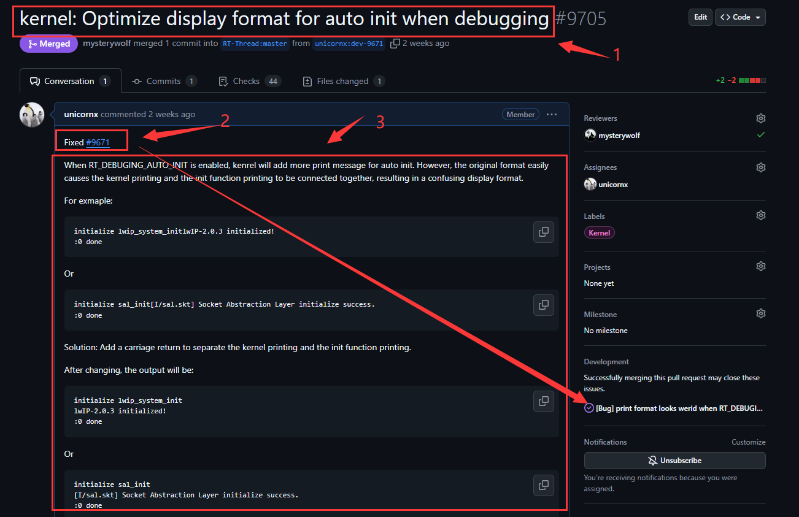
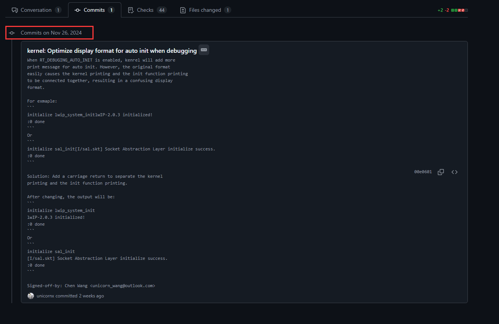

文章标题：**基于 Github 开发 RTT 常见问题汇总**

- 作者: 汪辰
- 联系方式: <unicorn_wang@outlook.com>
- 原文地址: <https://github.com/plctlab/plct-rt-thread/blob/notes/0.notes/20241212-github-tips.md>。


**How-to 列表**

<!-- TOC -->

- [1. How to setup git when you are using github](#1-how-to-setup-git-when-you-are-using-github)
- [2. How to write git commit message](#2-how-to-write-git-commit-message)
- [3. Things to note when submitting PR to RT-Thread](#3-things-to-note-when-submitting-pr-to-rt-thread)
- [4. What should I do after my PR is reviewed](#4-what-should-i-do-after-my-pr-is-reviewed)

<!-- /TOC -->

# 1. How to setup git when you are using github

See <https://docs.github.com/en/get-started/getting-started-with-git/set-up-git>.


# 2. How to write git commit message

首先阅读 [FAQ 1: How to setup git when you are using github](#1-how-to-setup-git-when-you-are-using-github)。确保你已经正确设置好你的环境，特别是你已经正确配置了你的 username 和 commit email address。

很多人提交 PR 时写得过于简单，这对项目的长久维护是不好的，所以特此对代码提交的 git commit 撰写规范化如下。

详细的参考：<https://docs.kernel.org/translations/zh_CN/process/submitting-patches.html>，建议读一下，有益于提高自身工程师素质。

下面是一个参考的例子：

```shell
$ git show c8914c7f2b
commit c8914c7f2bd4109bdb7f01f388bbc09e5e15c9a9
Author: Chen Wang <unicorn_wang@outlook.com>
Date:   Tue Jul 23 13:58:24 2024 +0800

    bsp: cvitek: fixed stacksize issue
    
    In the original Sconstruct script, `GetDepend('__STACKSIZE__')`
    is placed before the call to `PrepareBuilding()`, which causes
    the value of `GetDepend('__STACKSIZE__')` to always be False,
    and the value of `__STACKSIZE__` in `link_stacksize.lds` will
    not be updated.
    
    Solution: move the call if `PrepareBuilding()` ahead.
    
    Also sync and update the .config and rtconfig.h, plus the
    link_stacksize.lds.
    
    Signed-off-by: Chen Wang <unicorn_wang@outlook.com>
......
```

一个完整的 commit 文本包括以下三个部分，推荐用英文，也可以用中文。如果想用英文但感觉实在英文能力不够，现在在线机器翻译能力已经足够好帮助你把中文翻译成英文。

- 标题：必须提供。一行，尽量不要超过 80 个字符

  推荐加上前缀，譬如这里的例子中 "bsp: cvitek: " 就是前缀，其他模块/组件的前缀参考其他相关 commit。

- 正文：必须提供。

  如果是 bug fix，建议包括至少三部分，
  
  - “问题描述”：描述问题的现象
  - “问题分析”，导致 “问题” 出现的原因
  - “解决方案”，该补丁的解决思路，可以很简单，也可以详细描述

  如果是 new feature，建议包括至少两部分。

  - “需求来源”：为何要做这个新特性
  - “解决方案”，该补丁的解决思路，可以很简单，也可以详细描述

  如果改动的确很小，则以上要求可以简化为一句话描述。

- 签名：必须提供。格式："Signed-off-by: 姓名 <可以联系到您的邮箱地址>"

# 3. Things to note when submitting PR to RT-Thread

给 RT-Thread 提交 PR 时的注意事项

参考 <https://github.com/RT-Thread/rt-thread/pull/9705>



- (1): PR 的标题，正常情况下，如果 commit message 写的足够好，在提交 PR 时会自动填写为 commit message 的 title 部分相同。具体有关如何填写 commit message，请参考 [1. 如何编写 git commit message](#1-如何编写-git-commit-message)。

- (2): 这部分需要手动填写，按如上方式填写后可以将 PR 和对应的 Issue 关联起来，当此 PR 被关闭时，关联的 Issue 也会被自动关闭。
  
  如果没有对应的 issue，则此项可以忽略。但建议在提交 PR 前无论是 bug 还是 new feature 都提前提交一个 issue，方便社区提前 review，也可以提前知道这个 PR 是否的确需要去做。

- (3)：PR 正文，正常情况下，如果 commit message 写的足够好，在提交 PR 时会自动填写为 commit message 的正文部分。具体有关如何填写 commit message，请参考 [1. 如何编写 git commit message](#1-如何编写-git-commit-message)。

- (4): Commits 信息：提交 PR 请求正式 review 时应该确保 commits 的干净，不要将本地开发历史记录提交上来，没有特殊的情况，一般只会看到一个 commit, 参考下图。

  

  有时候修改比较大，则在一个 PR 中会有必要分成多个 commit 进行提交，也方便 review。一个 PR 包含多个 commit 的例子：<https://github.com/RT-Thread/rt-thread/pull/9703/commits>。

  
# 4. What should I do after my PR is reviewed

PR 经过审阅后我该怎么做

- 仔细阅读 Reviewer 的评论，如果接受则在线回复接受，如果有疑问则在线提出。请不要没有任何回应后就开始修改。切记社区的 Reviewer 都是友情在帮助你审阅代码，请对他人的劳动成果表示起码的尊重。

- 修改代码后重新提交，切记和第一次 PR 时一样，保持 commit 的干净。

- Re-request Reviewer 重新审阅。请点击 re-request review，方法如下图所示：

  

  


