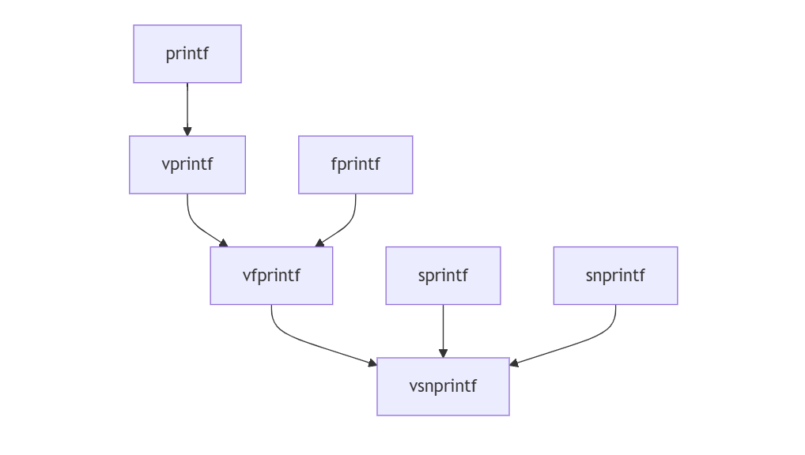

+ 作者：周家杰
+ 联系邮箱：2293611667@qq.com
+ 原文地址： https://github.com/plctlab/plct-rt-thread/blob/notes/0.notes/20250227-mlibc-overview.md


# 0.研宄背景

## 0.1Ｃ标准库

Ｃ标准库（ Ｃ Standard Library , libc ），为字符串处理、 数学计算、 输入输出处理、 内存管理以及其他操作系统服务提供宏、 类型定义和函数。

**标准头文件：**（c99）

`<assert.h>`, `<ctype.h>`, `<errno.h>`, `<float.h>`, `<locale.h>`, `<math.h>`, `<setjmp.h>`, `<limits.h>`, `<signal.h>`, `<stdarg.h>`, `<stddef.h>`, `<stdio.h>`, `<stdlib.h>`, `<string.h>`，`<time.h>`

**目前较流行的libc项目：**

| **项目名称**  | **协议**           | **特点**                                                 | **标准实现** |
| ------------- | ------------------ | -------------------------------------------------------- | ------------ |
| **glibc**     | GPLv2, LGPLv2.1    | 最广泛使用，功能全面，支持多平台，支持 POSIX 和 GNU 扩展 | C11          |
| **musl**      | MIT                | 轻量、高效                                               | C11          |
| **uClibc**    | GPLv2, LGPLv2.1    | 体积小，灵活配置                                         | C99          |
| **Newlib**    | GPLv2, LGPLv2.1    | 轻量                                                     | C99          |
| **llvm libc** | Apache License 2.0 | Clang 编译器的标准库实现                                 | C99          |
| **picolibc**  | GPLv2              | 极简                                                     | C99          |

大多数主流 libc 的实现使用大量的汇编语言，并采用特定的可能依赖于平台的ABI（ Application Binary Interface)

而目前mlibc更多基于源码实现。

## 0.2Ｃ标准(C99)

> **7.1.7 Use of library functions**
>
> ​	Each of the following statements applies unless explicitly stated otherwise in the detailed
> descriptions that follow. If an argument to a function has an invalid value (such as a value outside
> the domain of the function, or a pointer outside the address space of the program, or a null pointer),
> the behavioris undefined. If a function argumentis described as being an array, the pointer actually
> passed to the function shall have a value such that all address computationsand accesses to objects
> (that would be valid if the pointer did point to the first element of such an array) are in fact valid.
> Any function declared in a header may be additionally implemented as a macro defmed in the
> header, so a library function should not be declared explicitly if its header is included. Any macro
> definition of a function can be suppressed locally by enclosing the name of the function in
> parentheses, because the name is then not followed by the left parenthesisthat indicatesexpansion
> of a macro function name. For the same syntactic reason, it is permitted to take the address of a
> library function even if it is also defined as a macro.g5 The use of #undef to remove any macro
> definition will also ensure that an actual function is referred to. Any invocation of a library function
> that is implemented as a macro shall expand to code that evaluates each of its arguments exactly
> once, fully protected by parentheses where necessary, so it is generally safe to use arbitrary
> expressions as arguments. Likewise, those function-like macros described in the following
> subclauses may be invoked in an expression anywhere a function with a compatible return type
> could be called.96All object-like macros listed as expanding to integral constant expressionsshall
> additionally be suitable for use in # i f preprocessingdirectives.
>
> ​	Provided that a library function can be declared without reference to any type defined in a
> header, it is also permissible to declare the function, either explicitly or implicitly, and use it
> without including its associated header. If a function that accepts a variable argument list is not
> declared (explicitly or by including its associated header), the behavior is undefined.	

实现C库函数时，需要遵循一些基本规则和假设，以确保代码的可移植性和兼容性。

关于实现的假设：

- 标准头文件可能将名称视为保留字，包含一个头文件可能只是激活内置定义。
- 可以用包含定义的C源文件替换预定义函数，但实现必须处理与外部名称的潜在冲突。
- 库的文件名应遵循特定约定（例如，C源文件为八个小写字母后跟一个点和一个字母）。

代码风格：

- 每个可见函数都位于以函数命名的单独C源文件中（例如：strlen.c）。
- 秘密名称（内部函数/数据）以单个下划线后跟一个大写字母开头，通常位于以'X'开头的文件中。
- 不使用register声明，因为现代编译器高效处理寄存器分配。
- 代码通常被压缩以节省空间，但这在某些情况下降低了可读性。

标准头文件：

- 幂等性：使用宏守卫确保头文件只包含一次。
- 相互独立性：处理重叠定义（例如size_t, NULL）以防止包含多个头文件时发生冲突。
- 同义词：某些类型或函数（例如打印函数的va-list）在一个头文件中定义，但在其他头文件中使用。在头文件中使用同义词进行正确声明。

# 1.mlibc现状

## 1.1 基础架构

```
├───arch                -- Hardware-specific optimized implementations
├───crt                 -- Hardware-specific startup code
├───include             -- Header files
│   └───sys             -- System-related header files, typically included as <sys/head.h>
├───src                 -- Source files
│   ├───internal        -- Internal header files
│   ├───misc            -- Miscellaneous, contains modules that can be implemented in a single file
│   ├───stdio           -- Standard IO module
│   └───stdlib          -- Standard utility library module
├───helloworld          -- Helloworld testcase
│	└───qemu			-- QEMU bare-metal config
│		└───qemu-device	-- Specific to the QEMU virtual machine device, related scripts and header files
├───xscript             -- Scripts related to xmake
└───toolchains          -- xmake scripts related to toolchains
```

- 采用模块化设计，代码结构清晰
- 支持多种架构 (ARM/AARCH64/RISCV)

```
crt/
├── arm/         - ARM架构启动代码
├── aarch64/     - AARCH64架构启动代码 
├── riscv/       - RISC-V架构启动代码
└── common/      - 通用启动代码
```

> 操作系统装载程序之后，首先会把准备好 main 函数执行所需要的环境，并且负责调用 main 函数。运行这些代码的函数被称为入口函数或者叫入口点（**Entry Point**）。它往往是运行库的一部分。一个典型的程序运行步骤大致如下：
>
> + 操作系统在创建进程后，把控制权交到了程序的入口，这个入口往是运行库中的某个入口函数。
> + 入口函数对运行库和程序运行环境进行初始化，包括堆、I/O、线程、全局变量构造，等等。
> + 入口函数在完成初始化之后，调用 main 函数，正式开始执行程序主体部分。
> + main 函数执行完毕以后，返回到入口函数，入口函数进行清理工作，包括全局变量析构、堆销毁、关闭 I/O 等，然后进行系统调用结束进程。
>

**启动流程**

_start(内联汇编，.text.startup段) → _cstart(C初始化，.init段 ) → __start(系统初始化，.text.startup段) → main

## 1.2 功能实现

**1.2.1 stdio: 基本的文件IO操作**



```
已实现的核心功能:
- 基础IO: fopen/fclose/fread/fwrite 
- 格式化IO: printf/sprintf/snprintf/vprintf等
- 缓冲区管理: setvbuf/fflush
- 字符IO: getchar/putchar/fgetc/fputc

未实现的功能:
- scanf系列函数(格式化输入)
- gets/fgets(行读取)
- ferror/feof(错误检测)
- fileno(文件描述符获取)
- ungetc(字符回退)
```

**1.2.2 stdlib: 常用工具函数、内存管理**

目前已实现部分

```
1. 数值转换类
- atoi(), atol(), atoll() - 字符串转整数
- strtol(), strtoll(), strtoul(), strtoull() - 字符串转长整数
- atof(), strtod() - 字符串转浮点数
- itoa() - 整数转字符串

2. 数学计算类
- abs(), labs(), llabs() - 求绝对值 
- div(), ldiv(), lldiv() - 整数除法

3. 随机数相关
- rand(), rand_r() - 生成随机数
- srand() - 设置随机数种子

4. 内存管理(采用TLSF算法)
- malloc() - 动态分配内存
- free() - 释放内存 
- calloc() - 分配并清零内存
- realloc() - 重新分配内存

5. 其他工具函数
- qsort() - 快速排序
- bsearch() - 二分查找
- abort() - 异常终止程序
- exit() - 正常终止程序
```

未实现部分:

```
- mblen(), mbtowc(), wctomb() - 多字节字符转换
- mbstowcs(), wcstombs() - 多字节字符串转换
- system() - 执行系统命令
- getenv() - 环境变量操作
```

**1.2.3 string: 字符串处理**

```
1. 内存操作
- memcpy() - 内存复制
- memset() - 内存设置
- memcmp() - 内存比较

2. 字符串基本操作
- strcpy(), strncpy() - 字符串复制
- strcat(), strncat() - 字符串连接
- strtok() - 分割字符串
- strlen() - 计算字符串长度
- strcmp(), strncmp() - 字符串比较

3. 字符串搜索
- strpbrk() - 查找字符集中的字符
- strchr()，strrchr() - 查找字符
- strstr() - 查找子串
- strspn(), strcspn() - 计算字符串中特定字符的数量
```

未实现函数:

```
- strerror(): 将错误号映射到错误消息字符串。
- strxfrm(): 转换字符串，使得strcmp函数可以用于比较两个经过转换的字符串，并得到与strcoll函数相同的结果。
- strcoll(): 比较两个字符串，比较规则依赖于当前的区域设置
```

## 1.3 API覆盖

基于对[第一阶段](https://github.com/plctlab/mlibc/issues/50)的讨论，目前可以确定下来的API list如下( PSE51 去掉 pthread部分 ):

+ *：已有完整实现
+ -： 正在实现 尚未完整

(在测试前，均不代表可用)

| File | API | [mlibc][mlibc-repo] | [Embedded Artistry libc][ea-libc] |
|------|-----|---------------------|-----------------------------------|
| [ctype.h][ctype] | [isalnum][isalnum] | * | * |
| | [isalpha][isalpha] | * | * |
| | [isblank][isblank] | * | * |
| | [iscntrl][iscntrl] | * | * |
| | [isdigit][isdigit] | * | * |
| | [isgraph][isgraph] | * | * |
| | [islower][islower] | * | * |
| | [isprint][isprint] | * | * |
| | [ispunct][ispunct] | * | * |
| | [isspace][isspace] | * | * |
| | [isupper][isupper] | * | * |
| | [isxdigit][isxdigit] | * | * |
| | [tolower][tolower] | * | * |
| | [toupper][toupper] | * | * |
| [errno.h][errno] | | | |
| | [errno][errno-func] | - | * |
| [fcntl.h][fcntl] | | | |
| | [open][open] | - | |
| [fenv.h][fenv] | | | |
| | [feclearexcept][feclearexcept] | | * |
| | [fegetenv][fegetenv] | | * |
| | [fegetexceptflag][fegetexceptflag] | | * |
| | [fegetround][fegetround] | | * |
| | [feholdexcept][feholdexcept] | | * |
| | [feraiseexcept][feraiseexcept] | | * |
| | [fesetenv][fesetenv] | | * |
| | [fesetexceptflag][fesetexceptflag] | | * |
| | [fesetround][fesetround] | | * |
| | [fetestexcept][fetestexcept] | | * |
| | [feupdateenv][feupdateenv] | | * |
| [inttypes.h][inttypes] | | | |
| | [imaxabs][imaxabs] | * | * |
| | [imaxdiv][imaxdiv] | * | * |
| | [strtoimax][strtoimax] | * | * |
| | [strtoumax][strtoumax] | * | * |
| [locale.h][locale] | | | |
| | [localeconv][localeconv] | | * |
| | [setlocale][setlocale] | | * |
| [sched.h][sched] | | | |
| | [sched_get_priority_max][sched_get_priority_max] | | |
| | [sched_get_priority_min][sched_get_priority_min] | | |
| | [sched_rr_get_interval][sched_rr_get_interval] | | |
| [semaphore.h][semaphore] | | | |
| | [sem_close][sem_close] | | |
| | [sem_destroy][sem_destroy] | | |
| | [sem_getvalue][sem_getvalue] | | |
| | [sem_init][sem_init] | | |
| | [sem_open][sem_open] | | |
| | [sem_post][sem_post] | | |
| | [sem_timedwait][sem_timedwait] | | |
| | [sem_trywait][sem_trywait] | | |
| | [sem_unlink][sem_unlink] | | |
| | [sem_wait][sem_wait] | | |
| [setjmp.h][setjmp] | | | |
| | [longjmp][longjmp] | - | * |
| | [setjmp][setjmp] | - | * |
| [signal.h][signal] | | | |
| | [kill][kill] | | |
| | [pthread_kill][pthread_kill] | | |
| | [pthread_sigmask][pthread_sigmask] | | |
| | [raise][raise] | | |
| | [sigaction][sigaction] | | |
| | [sigaddset][sigaddset] | | |
| | [sigdelset][sigdelset] | | |
| | [sigemptyset][sigemptyset] | | |
| | [sigfillset][sigfillset] | | |
| | [sigismember][sigismember] | | |
| | [signal][signal-func] | | |
| | [sigpending][sigpending] | | |
| | [sigprocmask][sigprocmask] | | |
| | [sigqueue][sigqueue] | | |
| | [sigsuspend][sigsuspend] | | |
| | [sigtimedwait][sigtimedwait] | | |
| | [sigwait][sigwait] | | |
| | [sigwaitinfo][sigwaitinfo] | | |
| [stdarg.h][stdarg] | | | |
| | [va_arg][va_arg] | * | * |
| | [va_copy][va_copy] | * | * |
| | [va_end][va_end] | * | * |
| | [va_start][va_start] | * | * |
| [stdio.h][stdio] | | | |
| | [clearerr][clearerr] | | * |
| | [fclose][fclose] | * | * |
| | [fdopen][fdopen] | * | |
| | [feof][feof] | | * |
| | [ferror][ferror] | - | * |
| | [fflush][fflush] | * | * |
| | [fgetc][fgetc] | * | * |
| | [fgets][fgets] | * | * |
| | [fileno][fileno] | * | |
| | [flockfile][flockfile] | - | |
| | [fopen][fopen] | * | * |
| | [fprintf][fprintf] | * | * |
| | [fputc][fputc] | | * |
| | [fputs][fputs] | | * |
| | [fread][fread] | * | * |
| | [freopen][freopen] | | * |
| | [fscanf][fscanf] | | * |
| | [ftrylockfile][ftrylockfile] | - | |
| | [funlockfile][funlockfile] | - | |
| | [fwrite][fwrite] | * | * |
| | [getc][getc] | * | * |
| | [getc_unlocked][getc_unlocked] | * | |
| | [getchar][getchar] | * | |
| | [getchar_unlocked][getchar_unlocked] | * | |
| | [gets][gets] | * | * |
| | [perror][perror] | | * |
| | [printf][printf] | * | * |
| | [putc][putc] | * | * |
| | [putc_unlocked][putc_unlocked] | * | |
| | [putchar][putchar] | * | * |
| | [putchar_unlocked][putchar_unlocked] | * | |
| | [puts][puts] | * | * |
| | [scanf][scanf] | | * |
| | [setbuf][setbuf] | | * |
| | [setvbuf][setvbuf] | * | * |
| | [snprintf][snprintf] | * | * |
| | [sprintf][sprintf] | * | * |
| | [sscanf][sscanf] | | * |
| | [stderr][stderr] | * | |
| | [stdin][stdin] | * | |
| | [stdout][stdout] | * | |
| | [ungetc][ungetc] | | * |
| | [vfprintf][vfprintf] | * | * |
| | [vfscanf][vfscanf] | * | * |
| | [vprintf][vprintf] | * | * |
| | [vscanf][vscanf] | | * |
| | [vsnprintf][vsnprintf] | * | * |
| | [vsprintf][vsprintf] | * | * |
| | [vsscanf][vsscanf] | | * |
| [stdlib.h][stdlib] | | | |
| | [abort][abort] | - | * |
| | [abs][abs] | * | * |
| | [atof][atof] | * | * |
| | [atoi][atoi] | * | * |
| | [atol][atol] | * | * |
| | [atoll][atoll] | * | * |
| | [bsearch][bsearch] | * | * |
| | [calloc][calloc] | * | * |
| | [div][div] | * | * |
| | [free][free] | * | * |
| | [getenv][getenv] | * | * |
| | [labs][labs] | * | * |
| | [ldiv][ldiv] | * | * |
| | [llabs][llabs] | * | * |
| | [lldiv][lldiv] | * | * |
| | [malloc][malloc] | * | * |
| | [mktime][mktime] | | * |
| | [qsort][qsort] | * | * |
| | [rand][rand] | * | * |
| | [rand_r][rand_r] | * | * |
| | [realloc][realloc] | * | * |
| | [setenv][setenv] | * | |
| | [srand][srand] | * | * |
| | [strtod][strtod] | * | * |
| | [strtof][strtof] | * | * |
| | [strtol][strtol] | * | * |
| | [strtold][strtold] | * | * |
| | [strtoll][strtoll] | * | * |
| | [strtoul][strtoul] | * | * |
| | [strtoull][strtoull] | * | * |
| | [unsetenv][unsetenv] | * | |
| [string.h][string] | | | |
| | [memchr][memchr] | * | * |
| | [memcmp][memcmp] | * | * |
| | [memcpy][memcpy] | * | * |
| | [memmove][memmove] | * | * |
| | [memset][memset] | * | * |
| | [strcat][strcat] | * | * |
| | [strchr][strchr] | * | * |
| | [strcmp][strcmp] | * | * |
| | [strcoll][strcoll] | | * |
| | [strcpy][strcpy] | * | * |
| | [strcspn][strcspn] | * | * |
| | [strerror][strerror] | | * |
| | [strerror_r][strerror_r] | | * |
| | [strlen][strlen] | * | * |
| | [strncat][strncat] | * | * |
| | [strncmp][strncmp] | * | * |
| | [strncpy][strncpy] | * | * |
| | [strpbrk][strpbrk] | * | * |
| | [strrchr][strrchr] | * | * |
| | [strspn][strspn] | * | * |
| | [strstr][strstr] | * | * |
| | [strtok][strtok] | * | * |
| | [strtok_r][strtok_r] | * | |
| | [strxfrm][strxfrm] | | * |
| [sys/mman.h][sys_mman] | | | |
| | [mlockall][mlockall] | | |
| | [mmap][mmap] | | |
| | [munlock][munlock] | | |
| | [munmap][munmap] | | |
| | [shm_open][shm_open] | | |
| | [shm_unlink][shm_unlink] | | |
| [sys/utsname.h][sys_utsname] | | | |
| | [uname][uname] | * | |
| [time.h][time] | | | |
| | [asctime][asctime] | | * |
| | [asctime_r][asctime_r] | | * |
| | [clock_getres][clock_getres] | | |
| | [clock_gettime][clock_gettime] | | |
| | [clock_nanosleep][clock_nanosleep] | | |
| | [clock_settime][clock_settime] | | |
| | [ctime][ctime] | | |
| | [ctime_r][ctime_r] | | |
| | [difftime][difftime] | | |
| | [gmtime][gmtime] | * | |
| | [gmtime_r][gmtime_r] | * | |
| | [localtime][localtime] | | |
| | [localtime_r][localtime_r] | * | |
| | [nanosleep][nanosleep] | | |
| | [strftime][strftime] | * | |
| | [time][time-func] | | |
| | [timer_create][timer_create] | | |
| | [timer_delete][timer_delete] | | |
| | [timer_getoverrun][timer_getoverrun] | | |
| | [timer_gettime][timer_gettime] | | |
| | [timer_settime][timer_settime] | | |
| | [tzname][tzname] | | |
| | [tzset][tzset] | | |
| [unistd.h][unistd] | | | |
| | [alarm][alarm] | | |
| | [close][close] | | |
| | [environ][environ] | | |
| | [fdatasync][fdatasync] | | |
| | [fsync][fsync] | | |
| | [pause][pause] | | |
| | [read][read] | | |
| | [sysconf][sysconf] | | |
| | [write][write] | | |
| | [confstr][confstr] | | |

# 2.mlibc的改进点

## 2.1 缺乏测试架构

目前项目缺乏规范的测试流程，可以逐渐引入目前其他成熟开源项目的测试集，提高代码覆盖率。

- [picolibc/test at main · picolibc/picolibc](https://github.com/picolibc/picolibc/tree/main/test)
- [dietlibc/test at master · ensc/dietlibc](https://github.com/ensc/dietlibc/tree/master/test)
- [glibc/benchtests at master · lattera/glibc](https://github.com/lattera/glibc/tree/master/benchtests)
- [mlibc/tests at master · managarm/mlibc](https://github.com/managarm/mlibc/tree/master/tests)
- [libc/test at master · embeddedartistry/libc](https://github.com/embeddedartistry/libc/tree/master/test)

**建立分层测试框架：**

```
tests/
├── unit/          # 单元测试
└── platform/      # 平台测试
    ├── arm/
    ├── riscv/
    └── aarch64/
```

**添加自动化测试：**

```yaml
# .github/workflows/test.yml
name: mlibc Tests
jobs:
  test:
    runs-on: ubuntu-latest
    steps:
    - uses: actions/checkout@v2
    - name: Run Tests
      run: |
        ./run_unit_tests.sh
        ....
```


## 2.2 现有功能缺少覆盖

优先实现核心功能(C99)：

```c
// 文件操作
scanf/fscanf...
gets/fgets
ferror/feof

// 字符串处理
memmove
strdup
strtok

// 本地化支持
setlocale
localeconv

//错误处理机制
errno
perror
strerror
```

后续逐步完善 libm，locale.h ,  time.h ...？


## 2.3 确定对应C语言标准


目前mlibc没有明确对应的C语言标准，不同的标准需要实现的 API也有不同。

可以先就C99标准，把mlibc先做一定的完善，以功能的正确性、完整性为主，暂时不考虑性能？

或者不实现完整的 libc，针对其中的子集优化？


## 2.4 缺少针对架构的特定优化


项目期望里提到了“为小资源系统设计”和“针对risc-v 32/64进行优化”。

但目前由于移植性，项目主要是以共享纯 C 来实现。

所以后续可以针对 risc-v 32/64，arm 使用结构特定的汇编进行优化。


详细讨论参考：[Clarify the goals/aims of this project | 讨论并明确项目的目标 · Issue #46 · plctlab/mlibc](https://github.com/plctlab/mlibc/issues/46)

<!-- File header links -->
[ctype]: https://pubs.opengroup.org/onlinepubs/9699919799/basedefs/ctype.h.html
[errno]: https://pubs.opengroup.org/onlinepubs/9699919799/basedefs/errno.h.html
[fcntl]: https://pubs.opengroup.org/onlinepubs/9699919799/basedefs/fcntl.h.html
[fenv]: https://pubs.opengroup.org/onlinepubs/9699919799/basedefs/fenv.h.html
[inttypes]: https://pubs.opengroup.org/onlinepubs/9699919799/basedefs/inttypes.h.html
[locale]: https://pubs.opengroup.org/onlinepubs/9699919799/basedefs/locale.h.html
[sched]: https://pubs.opengroup.org/onlinepubs/9699919799/basedefs/sched.h.html
[semaphore]: https://pubs.opengroup.org/onlinepubs/9699919799/basedefs/semaphore.h.html
[setjmp]: https://pubs.opengroup.org/onlinepubs/9699919799/basedefs/setjmp.h.html
[signal]: https://pubs.opengroup.org/onlinepubs/9699919799/basedefs/signal.h.html
[stdarg]: https://pubs.opengroup.org/onlinepubs/9699919799/basedefs/stdarg.h.html
[stdio]: https://pubs.opengroup.org/onlinepubs/9699919799/basedefs/stdio.h.html
[stdlib]: https://pubs.opengroup.org/onlinepubs/9699919799/basedefs/stdlib.h.html
[string]: https://pubs.opengroup.org/onlinepubs/9699919799/basedefs/string.h.html
[sys_mman]: https://pubs.opengroup.org/onlinepubs/9699919799/basedefs/sys_mman.h.html
[sys_utsname]: https://pubs.opengroup.org/onlinepubs/9699919799/basedefs/sys_utsname.h.html
[time]: https://pubs.opengroup.org/onlinepubs/9699919799/basedefs/time.h.html
[unistd]: https://pubs.opengroup.org/onlinepubs/9699919799/basedefs/unistd.h.html

<!-- API function links -->
[isalnum]: https://pubs.opengroup.org/onlinepubs/9699919799/functions/isalnum.html
[isalpha]: https://pubs.opengroup.org/onlinepubs/9699919799/functions/isalpha.html
[isblank]: https://pubs.opengroup.org/onlinepubs/9699919799/functions/isblank.html
[iscntrl]: https://pubs.opengroup.org/onlinepubs/9699919799/functions/iscntrl.html
[isdigit]: https://pubs.opengroup.org/onlinepubs/9699919799/functions/isdigit.html
[isgraph]: https://pubs.opengroup.org/onlinepubs/9699919799/functions/isgraph.html
[islower]: https://pubs.opengroup.org/onlinepubs/9699919799/functions/islower.html
[isprint]: https://pubs.opengroup.org/onlinepubs/9699919799/functions/isprint.html
[ispunct]: https://pubs.opengroup.org/onlinepubs/9699919799/functions/ispunct.html
[isspace]: https://pubs.opengroup.org/onlinepubs/9699919799/functions/isspace.html
[isupper]: https://pubs.opengroup.org/onlinepubs/9699919799/functions/isupper.html
[isxdigit]: https://pubs.opengroup.org/onlinepubs/9699919799/functions/isxdigit.html
[tolower]: https://pubs.opengroup.org/onlinepubs/9699919799/functions/tolower.html
[toupper]: https://pubs.opengroup.org/onlinepubs/9699919799/functions/toupper.html
[errno-func]: https://pubs.opengroup.org/onlinepubs/9699919799/functions/errno.html
[open]: https://pubs.opengroup.org/onlinepubs/9699919799/functions/open.html
[feclearexcept]: https://pubs.opengroup.org/onlinepubs/9699919799/functions/feclearexcept.html
[fegetenv]: https://pubs.opengroup.org/onlinepubs/9699919799/functions/fegetenv.html
[fegetexceptflag]: https://pubs.opengroup.org/onlinepubs/9699919799/functions/fegetexceptflag.html
[fegetround]: https://pubs.opengroup.org/onlinepubs/9699919799/functions/fegetround.html
[feholdexcept]: https://pubs.opengroup.org/onlinepubs/9699919799/functions/feholdexcept.html
[feraiseexcept]: https://pubs.opengroup.org/onlinepubs/9699919799/functions/feraiseexcept.html
[fesetenv]: https://pubs.opengroup.org/onlinepubs/9699919799/functions/fesetenv.html
[fesetexceptflag]: https://pubs.opengroup.org/onlinepubs/9699919799/functions/fesetexceptflag.html
[fesetround]: https://pubs.opengroup.org/onlinepubs/9699919799/functions/fesetround.html
[fetestexcept]: https://pubs.opengroup.org/onlinepubs/9699919799/functions/fetestexcept.html
[feupdateenv]: https://pubs.opengroup.org/onlinepubs/9699919799/functions/feupdateenv.html
[imaxabs]: https://pubs.opengroup.org/onlinepubs/9699919799/functions/imaxabs.html
[imaxdiv]: https://pubs.opengroup.org/onlinepubs/9699919799/functions/imaxdiv.html
[strtoimax]: https://pubs.opengroup.org/onlinepubs/9699919799/functions/strtoimax.html
[strtoumax]: https://pubs.opengroup.org/onlinepubs/9699919799/functions/strtoumax.html
[localeconv]: https://pubs.opengroup.org/onlinepubs/9699919799/functions/localeconv.html
[setlocale]: https://pubs.opengroup.org/onlinepubs/9699919799/functions/setlocale.html
[sched_get_priority_max]: https://pubs.opengroup.org/onlinepubs/9699919799/functions/sched_get_priority_max.html
[sched_get_priority_min]: https://pubs.opengroup.org/onlinepubs/9699919799/functions/sched_get_priority_min.html
[sched_rr_get_interval]: https://pubs.opengroup.org/onlinepubs/9699919799/functions/sched_rr_get_interval.html
[sem_close]: https://pubs.opengroup.org/onlinepubs/9699919799/functions/sem_close.html
[sem_destroy]: https://pubs.opengroup.org/onlinepubs/9699919799/functions/sem_destroy.html
[sem_getvalue]: https://pubs.opengroup.org/onlinepubs/9699919799/functions/sem_getvalue.html
[sem_init]: https://pubs.opengroup.org/onlinepubs/9699919799/functions/sem_init.html
[sem_open]: https://pubs.opengroup.org/onlinepubs/9699919799/functions/sem_open.html
[sem_post]: https://pubs.opengroup.org/onlinepubs/9699919799/functions/sem_post.html
[sem_timedwait]: https://pubs.opengroup.org/onlinepubs/9699919799/functions/sem_timedwait.html
[sem_trywait]: https://pubs.opengroup.org/onlinepubs/9699919799/functions/sem_trywait.html
[sem_unlink]: https://pubs.opengroup.org/onlinepubs/9699919799/functions/sem_unlink.html
[sem_wait]: https://pubs.opengroup.org/onlinepubs/9699919799/functions/sem_wait.html
[longjmp]: https://pubs.opengroup.org/onlinepubs/9699919799/functions/longjmp.html
[setjmp]: https://pubs.opengroup.org/onlinepubs/9699919799/functions/setjmp.html
[kill]: https://pubs.opengroup.org/onlinepubs/9699919799/functions/kill.html
[pthread_kill]: https://pubs.opengroup.org/onlinepubs/9699919799/functions/pthread_kill.html
[pthread_sigmask]: https://pubs.opengroup.org/onlinepubs/9699919799/functions/pthread_sigmask.html
[raise]: https://pubs.opengroup.org/onlinepubs/9699919799/functions/raise.html
[sigaction]: https://pubs.opengroup.org/onlinepubs/9699919799/functions/sigaction.html
[sigaddset]: https://pubs.opengroup.org/onlinepubs/9699919799/functions/sigaddset.html
[sigdelset]: https://pubs.opengroup.org/onlinepubs/9699919799/functions/sigdelset.html
[sigemptyset]: https://pubs.opengroup.org/onlinepubs/9699919799/functions/sigemptyset.html
[sigfillset]: https://pubs.opengroup.org/onlinepubs/9699919799/functions/sigfillset.html
[sigismember]: https://pubs.opengroup.org/onlinepubs/9699919799/functions/sigismember.html
[signal-func]: https://pubs.opengroup.org/onlinepubs/9699919799/functions/signal.html
[sigpending]: https://pubs.opengroup.org/onlinepubs/9699919799/functions/sigpending.html
[sigprocmask]: https://pubs.opengroup.org/onlinepubs/9699919799/functions/sigprocmask.html
[sigqueue]: https://pubs.opengroup.org/onlinepubs/9699919799/functions/sigqueue.html
[sigsuspend]: https://pubs.opengroup.org/onlinepubs/9699919799/functions/sigsuspend.html
[sigtimedwait]: https://pubs.opengroup.org/onlinepubs/9699919799/functions/sigtimedwait.html
[sigwait]: https://pubs.opengroup.org/onlinepubs/9699919799/functions/sigwait.html
[sigwaitinfo]: https://pubs.opengroup.org/onlinepubs/9699919799/functions/sigwaitinfo.html
[va_arg]: https://pubs.opengroup.org/onlinepubs/9699919799/functions/va_arg.html
[va_copy]: https://pubs.opengroup.org/onlinepubs/9699919799/functions/va_copy.html
[va_end]: https://pubs.opengroup.org/onlinepubs/9699919799/functions/va_end.html
[va_start]: https://pubs.opengroup.org/onlinepubs/9699919799/functions/va_start.html
[clearerr]: https://pubs.opengroup.org/onlinepubs/9699919799/functions/clearerr.html
[fclose]: https://pubs.opengroup.org/onlinepubs/9699919799/functions/fclose.html
[fdopen]: https://pubs.opengroup.org/onlinepubs/9699919799/functions/fdopen.html
[feof]: https://pubs.opengroup.org/onlinepubs/9699919799/functions/feof.html
[ferror]: https://pubs.opengroup.org/onlinepubs/9699919799/functions/ferror.html
[fflush]: https://pubs.opengroup.org/onlinepubs/9699919799/functions/fflush.html
[fgetc]: https://pubs.opengroup.org/onlinepubs/9699919799/functions/fgetc.html
[fgets]: https://pubs.opengroup.org/onlinepubs/9699919799/functions/fgets.html
[fileno]: https://pubs.opengroup.org/onlinepubs/9699919799/functions/fileno.html
[flockfile]: https://pubs.opengroup.org/onlinepubs/9699919799/functions/flockfile.html
[fopen]: https://pubs.opengroup.org/onlinepubs/9699919799/functions/fopen.html
[fprintf]: https://pubs.opengroup.org/onlinepubs/9699919799/functions/fprintf.html
[fputc]: https://pubs.opengroup.org/onlinepubs/9699919799/functions/fputc.html
[fputs]: https://pubs.opengroup.org/onlinepubs/9699919799/functions/fputs.html
[fread]: https://pubs.opengroup.org/onlinepubs/9699919799/functions/fread.html
[freopen]: https://pubs.opengroup.org/onlinepubs/9699919799/functions/freopen.html
[fscanf]: https://pubs.opengroup.org/onlinepubs/9699919799/functions/fscanf.html
[ftrylockfile]: https://pubs.opengroup.org/onlinepubs/9699919799/functions/ftrylockfile.html
[funlockfile]: https://pubs.opengroup.org/onlinepubs/9699919799/functions/funlockfile.html
[fwrite]: https://pubs.opengroup.org/onlinepubs/9699919799/functions/fwrite.html
[getc]: https://pubs.opengroup.org/onlinepubs/9699919799/functions/getc.html
[getc_unlocked]: https://pubs.opengroup.org/onlinepubs/9699919799/functions/getc_unlocked.html
[getchar]: https://pubs.opengroup.org/onlinepubs/9699919799/functions/getchar.html
[getchar_unlocked]: https://pubs.opengroup.org/onlinepubs/9699919799/functions/getchar_unlocked.html
[gets]: https://pubs.opengroup.org/onlinepubs/9699919799/functions/gets.html
[perror]: https://pubs.opengroup.org/onlinepubs/9699919799/functions/perror.html
[printf]: https://pubs.opengroup.org/onlinepubs/9699919799/functions/printf.html
[putc]: https://pubs.opengroup.org/onlinepubs/9699919799/functions/putc.html
[putc_unlocked]: https://pubs.opengroup.org/onlinepubs/9699919799/functions/putc_unlocked.html
[putchar]: https://pubs.opengroup.org/onlinepubs/9699919799/functions/putchar.html
[putchar_unlocked]: https://pubs.opengroup.org/onlinepubs/9699919799/functions/putchar_unlocked.html
[puts]: https://pubs.opengroup.org/onlinepubs/9699919799/functions/puts.html
[scanf]: https://pubs.opengroup.org/onlinepubs/9699919799/functions/scanf.html
[setbuf]: https://pubs.opengroup.org/onlinepubs/9699919799/functions/setbuf.html
[setvbuf]: https://pubs.opengroup.org/onlinepubs/9699919799/functions/setvbuf.html
[snprintf]: https://pubs.opengroup.org/onlinepubs/9699919799/functions/snprintf.html
[sprintf]: https://pubs.opengroup.org/onlinepubs/9699919799/functions/sprintf.html
[sscanf]: https://pubs.opengroup.org/onlinepubs/9699919799/functions/sscanf.html
[stderr]: https://pubs.opengroup.org/onlinepubs/9699919799/functions/stderr.html
[stdin]: https://pubs.opengroup.org/onlinepubs/9699919799/functions/stdin.html
[stdout]: https://pubs.opengroup.org/onlinepubs/9699919799/functions/stdout.html
[ungetc]: https://pubs.opengroup.org/onlinepubs/9699919799/functions/ungetc.html
[vfprintf]: https://pubs.opengroup.org/onlinepubs/9699919799/functions/vfprintf.html
[vfscanf]: https://pubs.opengroup.org/onlinepubs/9699919799/functions/vfscanf.html
[vprintf]: https://pubs.opengroup.org/onlinepubs/9699919799/functions/vprintf.html
[vscanf]: https://pubs.opengroup.org/onlinepubs/9699919799/functions/vscanf.html
[vsnprintf]: https://pubs.opengroup.org/onlinepubs/9699919799/functions/vsnprintf.html
[vsprintf]: https://pubs.opengroup.org/onlinepubs/9699919799/functions/vsprintf.html
[vsscanf]: https://pubs.opengroup.org/onlinepubs/9699919799/functions/vsscanf.html
[abort]: https://pubs.opengroup.org/onlinepubs/9699919799/functions/abort.html
[abs]: https://pubs.opengroup.org/onlinepubs/9699919799/functions/abs.html
[atof]: https://pubs.opengroup.org/onlinepubs/9699919799/functions/atof.html
[atoi]: https://pubs.opengroup.org/onlinepubs/9699919799/functions/atoi.html
[atol]: https://pubs.opengroup.org/onlinepubs/9699919799/functions/atol.html
[atoll]: https://pubs.opengroup.org/onlinepubs/9699919799/functions/atoll.html
[bsearch]: https://pubs.opengroup.org/onlinepubs/9699919799/functions/bsearch.html
[calloc]: https://pubs.opengroup.org/onlinepubs/9699919799/functions/calloc.html
[div]: https://pubs.opengroup.org/onlinepubs/9699919799/functions/div.html
[free]: https://pubs.opengroup.org/onlinepubs/9699919799/functions/free.html
[getenv]: https://pubs.opengroup.org/onlinepubs/9699919799/functions/getenv.html
[labs]: https://pubs.opengroup.org/onlinepubs/9699919799/functions/labs.html
[ldiv]: https://pubs.opengroup.org/onlinepubs/9699919799/functions/ldiv.html
[llabs]: https://pubs.opengroup.org/onlinepubs/9699919799/functions/llabs.html
[lldiv]: https://pubs.opengroup.org/onlinepubs/9699919799/functions/lldiv.html
[malloc]: https://pubs.opengroup.org/onlinepubs/9699919799/functions/malloc.html
[mktime]: https://pubs.opengroup.org/onlinepubs/9699919799/functions/mktime.html
[qsort]: https://pubs.opengroup.org/onlinepubs/9699919799/functions/qsort.html
[rand]: https://pubs.opengroup.org/onlinepubs/9699919799/functions/rand.html
[rand_r]: https://pubs.opengroup.org/onlinepubs/9699919799/functions/rand_r.html
[realloc]: https://pubs.opengroup.org/onlinepubs/9699919799/functions/realloc.html
[setenv]: https://pubs.opengroup.org/onlinepubs/9699919799/functions/setenv.html
[srand]: https://pubs.opengroup.org/onlinepubs/9699919799/functions/srand.html
[strtod]: https://pubs.opengroup.org/onlinepubs/9699919799/functions/strtod.html
[strtof]: https://pubs.opengroup.org/onlinepubs/9699919799/functions/strtof.html
[strtol]: https://pubs.opengroup.org/onlinepubs/9699919799/functions/strtol.html
[strtold]: https://pubs.opengroup.org/onlinepubs/9699919799/functions/strtold.html
[strtoll]: https://pubs.opengroup.org/onlinepubs/9699919799/functions/strtoll.html
[strtoul]: https://pubs.opengroup.org/onlinepubs/9699919799/functions/strtoul.html
[strtoull]: https://pubs.opengroup.org/onlinepubs/9699919799/functions/strtoull.html
[unsetenv]: https://pubs.opengroup.org/onlinepubs/9699919799/functions/unsetenv.html
[memchr]: https://pubs.opengroup.org/onlinepubs/9699919799/functions/memchr.html
[memcmp]: https://pubs.opengroup.org/onlinepubs/9699919799/functions/memcmp.html
[memcpy]: https://pubs.opengroup.org/onlinepubs/9699919799/functions/memcpy.html
[memmove]: https://pubs.opengroup.org/onlinepubs/9699919799/functions/memmove.html
[memset]: https://pubs.opengroup.org/onlinepubs/9699919799/functions/memset.html
[strcat]: https://pubs.opengroup.org/onlinepubs/9699919799/functions/strcat.html
[strchr]: https://pubs.opengroup.org/onlinepubs/9699919799/functions/strchr.html
[strcmp]: https://pubs.opengroup.org/onlinepubs/9699919799/functions/strcmp.html
[strcoll]: https://pubs.opengroup.org/onlinepubs/9699919799/functions/strcoll.html
[strcpy]: https://pubs.opengroup.org/onlinepubs/9699919799/functions/strcpy.html
[strcspn]: https://pubs.opengroup.org/onlinepubs/9699919799/functions/strcspn.html
[strerror]: https://pubs.opengroup.org/onlinepubs/9699919799/functions/strerror.html
[strerror_r]: https://pubs.opengroup.org/onlinepubs/9699919799/functions/strerror_r.html
[strlen]: https://pubs.opengroup.org/onlinepubs/9699919799/functions/strlen.html
[strncat]: https://pubs.opengroup.org/onlinepubs/9699919799/functions/strncat.html
[strncmp]: https://pubs.opengroup.org/onlinepubs/9699919799/functions/strncmp.html
[strncpy]: https://pubs.opengroup.org/onlinepubs/9699919799/functions/strncpy.html
[strpbrk]: https://pubs.opengroup.org/onlinepubs/9699919799/functions/strpbrk.html
[strrchr]: https://pubs.opengroup.org/onlinepubs/9699919799/functions/strrchr.html
[strspn]: https://pubs.opengroup.org/onlinepubs/9699919799/functions/strspn.html
[strstr]: https://pubs.opengroup.org/onlinepubs/9699919799/functions/strstr.html
[strtok]: https://pubs.opengroup.org/onlinepubs/9699919799/functions/strtok.html
[strtok_r]: https://pubs.opengroup.org/onlinepubs/9699919799/functions/strtok_r.html
[strxfrm]: https://pubs.opengroup.org/onlinepubs/9699919799/functions/strxfrm.html
[mlockall]: https://pubs.opengroup.org/onlinepubs/9699919799/functions/mlockall.html
[mmap]: https://pubs.opengroup.org/onlinepubs/9699919799/functions/mmap.html
[munlock]: https://pubs.opengroup.org/onlinepubs/9699919799/functions/munlock.html
[munmap]: https://pubs.opengroup.org/onlinepubs/9699919799/functions/munmap.html
[shm_open]: https://pubs.opengroup.org/onlinepubs/9699919799/functions/shm_open.html
[shm_unlink]: https://pubs.opengroup.org/onlinepubs/9699919799/functions/shm_unlink.html
[uname]: https://pubs.opengroup.org/onlinepubs/9699919799/functions/uname.html
[asctime]: https://pubs.opengroup.org/onlinepubs/9699919799/functions/asctime.html
[asctime_r]: https://pubs.opengroup.org/onlinepubs/9699919799/functions/asctime_r.html
[clock_getres]: https://pubs.opengroup.org/onlinepubs/9699919799/functions/clock_getres.html
[clock_gettime]: https://pubs.opengroup.org/onlinepubs/9699919799/functions/clock_gettime.html
[clock_nanosleep]: https://pubs.opengroup.org/onlinepubs/9699919799/functions/clock_nanosleep.html
[clock_settime]: https://pubs.opengroup.org/onlinepubs/9699919799/functions/clock_settime.html
[ctime]: https://pubs.opengroup.org/onlinepubs/9699919799/functions/ctime.html
[ctime_r]: https://pubs.opengroup.org/onlinepubs/9699919799/functions/ctime_r.html
[difftime]: https://pubs.opengroup.org/onlinepubs/9699919799/functions/difftime.html
[gmtime]: https://pubs.opengroup.org/onlinepubs/9699919799/functions/gmtime.html
[gmtime_r]: https://pubs.opengroup.org/onlinepubs/9699919799/functions/gmtime_r.html
[localtime]: https://pubs.opengroup.org/onlinepubs/9699919799/functions/localtime.html
[localtime_r]: https://pubs.opengroup.org/onlinepubs/9699919799/functions/localtime_r.html
[nanosleep]: https://pubs.opengroup.org/onlinepubs/9699919799/functions/nanosleep.html
[strftime]: https://pubs.opengroup.org/onlinepubs/9699919799/functions/strftime.html
[time-func]: https://pubs.opengroup.org/onlinepubs/9699919799/functions/time.html
[timer_create]: https://pubs.opengroup.org/onlinepubs/9699919799/functions/timer_create.html
[timer_delete]: https://pubs.opengroup.org/onlinepubs/9699919799/functions/timer_delete.html
[timer_getoverrun]: https://pubs.opengroup.org/onlinepubs/9699919799/functions/timer_getoverrun.html
[timer_gettime]: https://pubs.opengroup.org/onlinepubs/9699919799/functions/timer_gettime.html
[timer_settime]: https://pubs.opengroup.org/onlinepubs/9699919799/functions/timer_settime.html
[tzname]: https://pubs.opengroup.org/onlinepubs/9699919799/functions/tzname.html
[tzset]: https://pubs.opengroup.org/onlinepubs/9699919799/functions/tzset.html
[alarm]: https://pubs.opengroup.org/onlinepubs/9699919799/functions/alarm.html
[close]: https://pubs.opengroup.org/onlinepubs/9699919799/functions/close.html
[environ]: https://pubs.opengroup.org/onlinepubs/9699919799/functions/environ.html
[fdatasync]: https://pubs.opengroup.org/onlinepubs/9699919799/functions/fdatasync.html
[fsync]: https://pubs.opengroup.org/onlinepubs/9699919799/functions/fsync.html
[pause]: https://pubs.opengroup.org/onlinepubs/9699919799/functions/pause.html
[read]: https://pubs.opengroup.org/onlinepubs/9699919799/functions/read.html
[sysconf]: https://pubs.opengroup.org/onlinepubs/9699919799/functions/sysconf.html
[write]: https://pubs.opengroup.org/onlinepubs/9699919799/functions/write.html
[confstr]: https://pubs.opengroup.org/onlinepubs/9699919799/functions/confstr.html

<!-- Repository links -->
[mlibc-repo]: https://github.com/plctlab/mlibc
[ea-libc]: https://github.com/embeddedartistry/libc

