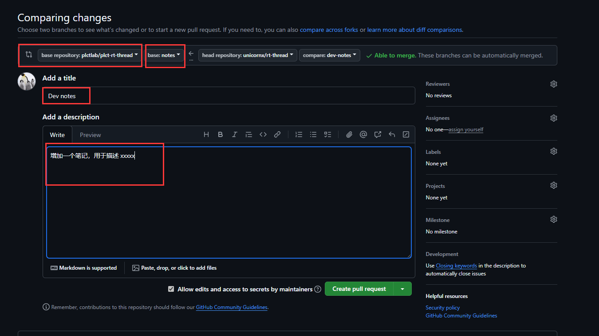

**文件夹 `0.notes` 用于收集和归档 PLCT-lab RT-Thread 兴趣小组的笔记**

<!-- TOC -->

- [如何添加一个笔记文件](#如何添加一个笔记文件)
- [如何提交 git commit](#如何提交-git-commit)

<!-- /TOC -->

有问题请联系: 汪辰, 电子邮箱地址: <wangchen20@iscas.ac.cn> 或者 <unicorn_wang@outlook.com>。

# 如何添加一个笔记文件

为方便整理，添加笔记文件请遵循以下简单规则：

- 一个笔记一个文件，放在文件夹 `0.notes` 下。文件格式请使用 markdown 语法。
- 文件名命名规则：`yyyymmdd-string1-string2-[...].md`, 以时间戳开头，4 位年 2 位月 2 位日，后跟多个英文字符串，中间以 `-` 分隔，文件名后缀 `.md`。
- 文件中如有图片，请放在 `0.notes/pictures` 下，每篇笔记一个子目录，子目录的名称和笔记文件名称（除去 `.md` 后缀部分）相同即可。
- 笔记文件的例子模板请参考 [`0.notes/20241115-notes-example.md`](./20241115-notes-example.md)
- 如果大家喜欢笔记放自己的 blog 网站上也可以 pr 你自己 blog 的链接给我，链接作为 md 文件的正文即可。

提交笔记文件请走本 github 仓库的 PR 流程，以下是简单描述。

git 操作示例：

默认已经本地 clone 过一个 RT-Thread 的仓库，进入该仓库后执行

```shell
$ git remote add plctlab git@github.com:plctlab/plct-rt-thread.git
$ git fetch --all
$ git checkout notes
```

目前该分支上删除了其他和笔记无关的代码部分。

```shell
$ ls -l
total 16
drwxrwxr-x 3 u u  4096 11月 15 10:22 0.notes
-rw-rw-r-- 1 u u 11357 11月 15 10:22 LICENSE
```

创建一个开发分支：
```shell
$ git checkout -b dev-notes
$ # 编写 note ......
$ git add .
$ git commit -m "add notes: xxx" -s # `-s` 用于加上自己的签名
$ git push origin dev-notes # 假设你自己的远程 github 仓库是 origin
```

注意: 有关 commit 的撰写要求，见 [“如何提交 git commit”](#如何提交-git-commit)

进入 github 提交 PR（细节不赘述），需要注意创建 PR 时选择好对应的的 **"base repository"**(目标仓库) 和 **"base"**(目标分支)，默认可能不是我们期望的仓库和分支名称。这里：

- **"base repository"** 一定要确保选择 **plctlab/plct-rt-thread**。
- **"base"** 一定要确保选择 **notes**。

编辑 title 和 description 后就可以提交了。



# 如何提交 git commit

帮助大家方便清晰地了解补丁，特此规范化代码提交的 git commit 撰写如下。注，本说明同样适用于针对 <https://github.com/RT-Thread/rt-thread> 的提交。

具体参考 [如何编写 git commit message](./20241212-github-tips.md) 。